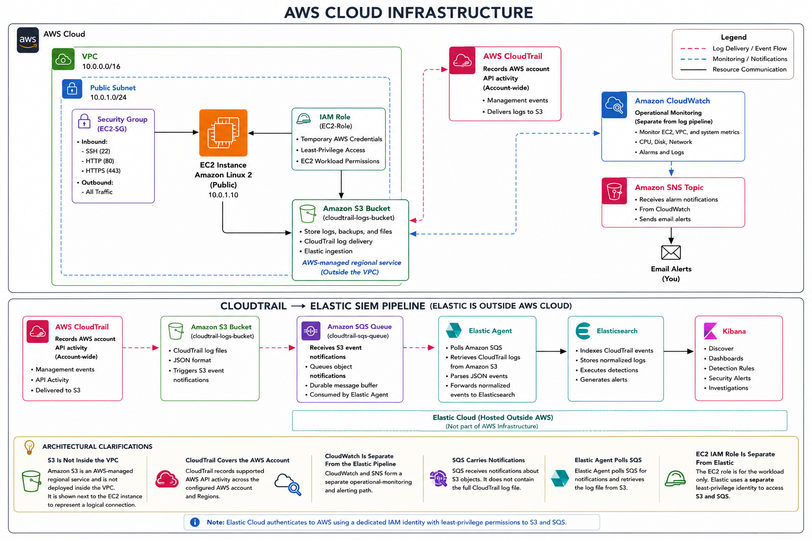

# AWS Cloud Infrastructure and Elastic SIEM Architecture



## Overview

This document explains the architecture of the **AWS Cloud Security Monitoring Lab**.

The project combines two connected environments:

1. An AWS home lab used to practice cloud infrastructure, networking, identity and access management, logging, monitoring, and security controls.
2. An Elastic SIEM workflow used to ingest AWS CloudTrail logs, create detection rules, generate security alerts, and support SOC investigations.

The complete project demonstrates the full cloud security monitoring lifecycle:

```text
Build AWS infrastructure
        ↓
Generate AWS activity
        ↓
Record activity with CloudTrail
        ↓
Store logs in Amazon S3
        ↓
Send object notifications through Amazon SQS
        ↓
Ingest and normalize events with Elastic Agent
        ↓
Store and search events in Elasticsearch
        ↓
Detect suspicious activity in Elastic Security
        ↓
Investigate alerts through Kibana and the SOC dashboard
```

---

# Architecture Diagram


The architecture is divided into two logical sections:

- AWS cloud infrastructure
- Elastic security monitoring workflow

The AWS environment generates the activity being monitored. CloudTrail records that activity and sends the logs through S3 and SQS to Elastic.

---

# 1. AWS Cloud Infrastructure

The AWS portion of the project contains the following services:

- Amazon VPC
- Public subnet
- Internet Gateway
- Public route table
- Security group
- Amazon EC2
- IAM role
- Amazon S3
- AWS CloudTrail
- Amazon CloudWatch
- Amazon SNS

These services create the cloud environment, secure access to resources, record account activity, and provide infrastructure monitoring.

---

# 2. Amazon VPC

The lab uses a custom Amazon Virtual Private Cloud with the following CIDR range:

```text
10.0.0.0/16
```

A VPC is a logically isolated network inside AWS.

It provides the network boundary in which resources such as EC2 instances, subnets, route tables, and security groups are deployed.

## Purpose

The VPC provides:

- An isolated AWS network
- Private IP address space
- Network segmentation
- Routing control
- Security-group enforcement
- A foundation for future cloud security projects

## Why a Custom VPC Was Used

Using a custom VPC demonstrates that the network was intentionally designed instead of relying entirely on the AWS default VPC.

The `/16` address range leaves room for future expansion into:

- Additional public subnets
- Private subnets
- Database subnets
- Load balancer subnets
- Multi-Availability Zone architecture

---

# 3. Public Subnet

The public subnet uses the following CIDR range:

```text
10.0.1.0/24
```

A subnet divides the larger VPC network into a smaller address range.

The subnet is considered public because its associated route table contains a route to an Internet Gateway.

## Purpose

The public subnet hosts the Amazon Linux EC2 instance used in the home lab.

## Important Clarification

A resource is not automatically reachable from the internet simply because it is located in a public subnet.

Internet access also depends on:

- The route table
- A public IPv4 address
- Security-group rules
- Network ACL rules
- The application listening on the permitted port

---

# 4. Internet Gateway

The Internet Gateway is attached to the VPC.

It provides a path between the VPC and the public internet.

## Traffic Flow

```text
Internet
   ↓
Internet Gateway
   ↓
Public Route Table
   ↓
Public Subnet
   ↓
Security Group
   ↓
EC2 Instance
```

The Internet Gateway provides connectivity, but it does not independently authorize traffic.

Access is still controlled by:

- Route tables
- Security groups
- Network ACLs
- Host-level firewalls
- Application configuration

---

# 5. Public Route Table

The public route table contains a default route similar to:

```text
Destination: 0.0.0.0/0
Target: Internet Gateway
```

The destination `0.0.0.0/0` represents all IPv4 addresses not matched by a more specific route.

## Purpose

This route allows resources in the public subnet to send internet-bound traffic through the Internet Gateway.

## Security Role

A route table determines where traffic can travel.

It does not decide whether a connection is permitted.

Connection authorization is handled by security controls such as:

- Security groups
- Network ACLs
- Operating system firewalls
- Application permissions

---

# 6. Security Group

The EC2 security group acts as a stateful virtual firewall attached to the EC2 instance.

The lab includes inbound access for services such as:

```text
SSH    TCP/22
HTTP   TCP/80
HTTPS  TCP/443
```

## Stateful Behavior

Security groups are stateful.

When an inbound connection is allowed, the response traffic is automatically permitted.

A separate outbound return rule is not required for that established connection.

## Recommended Security Configuration

- Restrict SSH to the administrator's public IP address.
- Allow HTTP publicly only when intentionally hosting a test web page.
- Allow HTTPS publicly only when TLS is configured.
- Remove temporary test rules after validation.
- Avoid opening administrative ports to `0.0.0.0/0`.
- Keep outbound access limited when practical.

## Detection Relevance

Security-group modifications are recorded by CloudTrail.

The project includes a custom detection for:

```text
AuthorizeSecurityGroupIngress
RevokeSecurityGroupIngress
```

This allows Elastic to alert whenever inbound firewall rules are added or removed.

---

# 7. Amazon EC2

The EC2 instance runs Amazon Linux and functions as the primary compute resource in the home lab.

## Uses

The instance can be used to:

- Host a simple Apache web server
- Generate AWS activity
- Test security-group access
- Use an IAM role
- Publish metrics to CloudWatch
- Access S3
- Support future cloud security exercises

## Public Connectivity Requirements

For the instance to be reachable from the internet, it requires:

- Placement in a public subnet
- A public IPv4 address
- A route to the Internet Gateway
- A security-group rule permitting the requested port
- A running service listening on that port

## Security Considerations

The instance should follow these practices:

- Use an IAM role instead of hardcoded credentials.
- Restrict SSH access.
- Patch the operating system.
- Remove unnecessary services.
- Avoid storing secrets in scripts.
- Use key-based authentication.
- Use AWS Systems Manager Session Manager when possible.
- Enable logging and monitoring.

---

# 8. IAM Role for EC2

The EC2 instance uses an IAM role attached through an instance profile.

The role allows the EC2 instance to obtain temporary AWS credentials automatically.

## Why the Role Matters

Without an IAM role, an application may require manually configured access keys.

Long-lived access keys can be exposed through:

- Scripts
- Configuration files
- Shell history
- Source code repositories
- Backups
- Shared documents

An IAM role avoids hardcoding credentials.

AWS automatically supplies and rotates temporary credentials for the instance.

## Least Privilege

The role should contain only the permissions required by the EC2 workload.

For example, the role should access only the specific S3 bucket or object prefix needed by the application.

A least-privilege policy may restrict:

- Allowed AWS actions
- Resource ARNs
- Object prefixes
- AWS Regions
- Access conditions

## EC2 Role Versus Elastic Identity

The EC2 role and the Elastic ingestion identity are separate.

```text
EC2 Instance
     ↓
EC2 IAM Role
     ↓
Temporary AWS Credentials
```

```text
Elastic Cloud
     ↓
Dedicated IAM Identity
     ↓
Access to SQS and S3
```

The EC2 role is used by the EC2 workload.

The Elastic identity is used by Elastic to retrieve CloudTrail logs.

---

# 9. Amazon S3

Amazon S3 stores the CloudTrail log files.

It may also be used for:

- Lab files
- Backups
- Application data
- Project artifacts

CloudTrail sends compressed JSON log files to the configured S3 bucket.

## Role in the Monitoring Pipeline

```text
AWS CloudTrail
      ↓
Amazon S3
      ↓
CloudTrail Log Files
```

S3 acts as the durable source of record for the original logs.

Elastic is used for analysis and alerting, while S3 preserves the raw audit files.

## Why S3 Is Important

S3 supports:

- Long-term retention
- Historical investigations
- Compliance
- Reprocessing
- Recovery after ingestion failures
- Validation of Elastic fields
- Independent storage outside the SIEM

## Recommended Security Controls

- Enable Block Public Access.
- Use least-privilege bucket policies.
- Enable encryption at rest.
- Enable versioning where appropriate.
- Configure lifecycle policies.
- Restrict administrative access.
- Consider CloudTrail log-file validation.
- Prevent unauthorized deletion.

## Architectural Clarification

Amazon S3 is not actually located inside the VPC.

It is an AWS-managed regional service.

It is shown near the EC2 instance in the diagram to represent the logical relationship between the resources.

---

# 10. AWS CloudTrail

CloudTrail is the primary audit-logging service in the project.

It records AWS API activity generated through:

- AWS Management Console
- AWS CLI
- AWS SDKs
- AWS services
- IAM users
- Assumed roles
- The AWS root account
- Automated tools

## Events Used in This Project

```text
ConsoleLogin
CreateAccessKey
DeleteAccessKey
AttachUserPolicy
CreateUser
DeleteUser
StopLogging
DeleteTrail
AuthorizeSecurityGroupIngress
RevokeSecurityGroupIngress
AssumeRole
```

## Information Recorded

A CloudTrail event may contain:

- Event timestamp
- AWS service
- API action
- AWS Region
- Source IP address
- User agent
- Identity type
- IAM ARN
- Request parameters
- Response elements
- Success or failure details

## Scope

CloudTrail is not limited to the EC2 instance.

It records supported API activity across the AWS account and configured Regions.

This includes activity involving:

- IAM
- EC2
- S3
- CloudTrail
- Security groups
- Roles
- Access keys
- Console logins

---

# 11. Amazon CloudWatch

CloudWatch provides operational monitoring for AWS resources.

It can collect:

- CPU utilization
- Network activity
- Disk metrics
- Application logs
- System logs
- Custom metrics
- Alarm state changes

## CloudWatch Versus CloudTrail

| Service | Primary Purpose |
|---|---|
| CloudTrail | Records AWS API and account activity |
| CloudWatch | Monitors metrics, logs, alarms, and operational health |

Examples:

```text
CreateUser
```

is a CloudTrail event.

```text
High EC2 CPU utilization
```

is a CloudWatch metric.

## Role in the Lab

CloudWatch demonstrates infrastructure monitoring alongside security auditing.

It is not required for the CloudTrail-to-Elastic ingestion pipeline.

---

# 12. Amazon SNS

Amazon Simple Notification Service receives notifications from CloudWatch alarms.

## Example Workflow

```text
EC2 Metric
    ↓
CloudWatch Alarm
    ↓
SNS Topic
    ↓
Email Notification
```

For example, a CloudWatch alarm may trigger when EC2 CPU utilization exceeds a defined threshold.

CloudWatch publishes the alarm notification to SNS.

SNS then sends an email notification to the subscribed address.

## Security Relevance

SNS provides operational notifications.

Elastic Security separately provides detection alerts.

The project therefore includes two monitoring paths:

```text
CloudWatch → SNS → Email
```

and:

```text
CloudTrail → Elastic Security → Detection Alert
```

---

# 13. Elastic SIEM Workflow

The CloudTrail-to-Elastic pipeline is:

```text
AWS CloudTrail
      ↓
Amazon S3
      ↓
Amazon SQS
      ↓
Elastic Agent
      ↓
Elasticsearch
      ↓
Kibana
      ↓
Detection Rules and SOC Dashboard
```

Each component performs a separate function.

---

# 14. CloudTrail Generates the Event

When an AWS action occurs, CloudTrail creates an event.

Example:

```text
An administrator attaches a policy to an IAM user.
```

CloudTrail records:

```text
event.action = AttachUserPolicy
```

The event may also include:

- The identity that performed the action
- The target IAM user
- The policy ARN
- The source IP address
- The AWS Region
- The event time
- Whether the request succeeded

CloudTrail later delivers the event in a log file to S3.

---

# 15. S3 Stores the Raw Logs

CloudTrail writes log files into the S3 bucket using an AWS-defined folder structure.

Example:

```text
s3://cloudtrail-log-bucket/
└── AWSLogs/
    └── account-id/
        └── CloudTrail/
            └── region/
                └── year/
                    └── month/
                        └── day/
                            └── log-file.json.gz
```

Each compressed JSON file can contain multiple CloudTrail events.

## Importance of Raw Logs

The raw S3 records remain useful for:

- Historical review
- Compliance
- Evidence preservation
- Reprocessing
- Troubleshooting
- Comparing raw AWS data with Elastic-normalized fields

---

# 16. S3 Sends Notifications to SQS

When CloudTrail creates a new object in the S3 bucket, S3 generates an object-created notification.

That notification is sent to the configured SQS queue.

## Conceptual Flow

```text
New CloudTrail Object in S3
              ↓
S3 Event Notification
              ↓
Amazon SQS Message
```

The SQS message normally does not contain the entire CloudTrail log file.

It contains information identifying the new S3 object.

---

# 17. Amazon SQS

Amazon SQS acts as a durable message buffer between S3 and Elastic.

## Why SQS Is Used

SQS provides:

- Message durability
- Retry support
- Temporary buffering
- Decoupling between AWS and Elastic
- Protection against brief ingestion outages
- Scalable event processing

Without SQS, Elastic might need to continuously scan the entire S3 bucket for new objects.

## How the Workflow Operates

```text
Elastic Agent polls SQS
          ↓
Receives S3 object notification
          ↓
Identifies the bucket and object key
          ↓
Retrieves the CloudTrail file from S3
          ↓
Processes the records
```

## Important Clarification

SQS does not normally send the complete CloudTrail logs directly to Elastic.

SQS tells Elastic where the new S3 log object is located.

---

# 18. Elastic Agent

Elastic Agent runs the AWS integration used to ingest CloudTrail logs.

## Responsibilities

Elastic Agent:

- Authenticates to AWS
- Polls the SQS queue
- Reads queue messages
- Locates S3 objects
- Downloads CloudTrail files
- Decompresses the files
- Parses JSON records
- Maps fields into Elastic
- Sends events to Elasticsearch

## AWS Permissions

The Elastic ingestion identity needs permissions such as:

- Read messages from the SQS queue
- Delete processed SQS messages
- Read CloudTrail objects from the S3 bucket
- Retrieve queue attributes
- Retrieve bucket information when required

The identity should not receive broad administrative permissions.

## Credential Model

The project used a dedicated IAM user for the Elastic integration because Elastic Cloud operates outside the AWS account.

The IAM user uses access keys for authentication.

Those credentials should be:

- Dedicated only to Elastic ingestion
- Stored securely
- Rotated
- Monitored
- Limited by least privilege
- Deleted when no longer needed

---

# 19. Elasticsearch

Elasticsearch receives the parsed CloudTrail events from Elastic Agent.

It stores the events in indices or data streams and makes them searchable.

## Capabilities

Elasticsearch enables:

- Fast search
- Field-based filtering
- Aggregation
- Event correlation
- Time-based analysis
- Detection-rule execution
- Dashboard visualization
- Alert generation

## Example KQL Search

```kql
event.dataset:"aws.cloudtrail"
and event.action:"CreateAccessKey"
```

This query searches for CloudTrail events where an IAM access key was created.

---

# 20. Kibana

Kibana is the analyst-facing interface used to search, visualize, detect, and investigate AWS activity.

The project uses Kibana for:

- Discover
- Elastic Security
- Detection rules
- Alert review
- KQL searches
- Lens visualizations
- SOC dashboards
- Event investigation

---

# 21. Discover

Discover allows the analyst to inspect CloudTrail events directly.

Useful fields include:

```text
@timestamp
event.dataset
event.action
event.outcome
source.ip
user.name
aws.cloudtrail.user_identity.type
aws.cloudtrail.user_identity.arn
aws.cloudtrail.flattened.request_parameters
```

Discover was used to verify that AWS events were successfully ingested before validating the detection rules.

---

# 22. Elastic Security Detection Rules

Elastic Security evaluates CloudTrail events against the custom KQL rules.

When an event matches a rule, Elastic creates an alert document.

Example:

```kql
event.dataset:"aws.cloudtrail"
and event.action:"StopLogging"
```

When the `StopLogging` CloudTrail event is ingested, the rule generates a critical alert.

---

# 23. SOC Dashboard

The SOC dashboard combines general CloudTrail activity and custom security alerts.

## General Activity Panels

- Total CloudTrail Events
- CloudTrail Activity Over Time
- Top AWS API Calls
- Top IAM Identities
- Top Source IP Addresses

## Detection Panels

- Detection Alert Table
- Alerts by Severity

## Why Both Are Needed

The general activity panels answer:

```text
What is happening in the AWS account?
```

The detection panels answer:

```text
Which events matched security rules?
```

Routine API actions may appear in the general activity charts, including:

```text
GetBucketAcl
ListPolicies
ListAccessKeys
DescribeInstanceTypes
AssumeRole
```

These are not necessarily alerts.

They are normal CloudTrail activity.

---

# 24. End-to-End Example: Security Group Change

The following example shows how a security-group modification moves through the full architecture.

## Step 1: The AWS Activity Occurs

An administrator adds an inbound rule to a security group.

Example:

```text
Allow TCP/22 from a selected source IP
```

## Step 2: AWS Processes the API Call

The AWS API action is:

```text
AuthorizeSecurityGroupIngress
```

## Step 3: CloudTrail Records the Event

CloudTrail records:

- The responsible identity
- The target security group
- The source IP address
- The protocol
- The port
- The allowed CIDR range
- The event time
- The outcome

## Step 4: CloudTrail Sends the Log to S3

The event is included in a CloudTrail log file and delivered to the configured S3 bucket.

## Step 5: S3 Notifies SQS

S3 creates an event notification identifying the new log object.

The notification is sent to SQS.

## Step 6: Elastic Agent Reads the Queue

Elastic Agent polls the SQS queue and receives the notification.

## Step 7: Elastic Agent Retrieves the S3 Object

Elastic Agent downloads the CloudTrail log file from S3.

## Step 8: Elastic Agent Parses the Event

The JSON event is parsed and mapped into searchable Elastic fields.

## Step 9: Elasticsearch Stores the Event

The event becomes searchable using KQL.

```kql
event.dataset:"aws.cloudtrail"
and event.action:"AuthorizeSecurityGroupIngress"
```

## Step 10: The Detection Rule Matches

The custom rule searches for:

```kql
event.dataset:"aws.cloudtrail"
and event.action:(
  "AuthorizeSecurityGroupIngress"
  or
  "RevokeSecurityGroupIngress"
)
```

## Step 11: Elastic Creates an Alert

The matching event generates a high-severity detection alert.

## Step 12: The Dashboard Displays the Alert

The event may appear in:

- Detection Alert Table
- Alerts by Severity
- Top AWS API Calls
- Top IAM Identities
- Top Source IP Addresses
- CloudTrail Activity Timeline

## Step 13: The Analyst Investigates

The analyst reviews:

- Who made the change
- Which security group was modified
- Which port was affected
- Which source range was allowed
- Whether the change was approved
- Whether the same identity performed other suspicious actions

---

# 25. Custom Detection Coverage

The project includes ten custom detections.

| Detection | CloudTrail Action | Severity |
|---|---|---|
| Create Access Key | `CreateAccessKey` | High |
| Delete Access Key | `DeleteAccessKey` | Medium |
| Attach Administrator Policy | `AttachUserPolicy` | High |
| IAM User Created | `CreateUser` | Medium |
| IAM User Deleted | `DeleteUser` | Medium |
| Stop CloudTrail Logging | `StopLogging` | Critical |
| Delete CloudTrail | `DeleteTrail` | Critical |
| Security Group Changes | `AuthorizeSecurityGroupIngress`, `RevokeSecurityGroupIngress` | High |
| Root Console Login | `ConsoleLogin` with root identity | Critical |
| IAM Role Assumed | `AssumeRole` | Low |

These rules convert raw AWS audit activity into prioritized security alerts.

---

# 26. Security Controls Demonstrated

## Identity Security

- IAM users
- IAM groups
- IAM roles
- IAM policies
- Least-privilege access
- Temporary EC2 credentials
- Dedicated Elastic ingestion identity
- Root account monitoring
- Privilege-escalation detection
- Access-key monitoring

## Network Security

- Custom VPC
- Public subnet
- Internet Gateway
- Route table
- Security groups
- Restricted SSH access
- Monitoring of firewall changes

## Logging and Auditing

- CloudTrail management events
- Centralized S3 storage
- SQS event notifications
- Elastic Agent ingestion
- Elasticsearch indexing
- Custom detection rules
- Alert validation

## Operational Monitoring

- CloudWatch metrics
- CloudWatch alarms
- SNS email notifications

## Security Analytics

- KQL
- Detection engineering
- Severity assignment
- MITRE ATT&CK mapping
- Kibana dashboards
- Alert investigation
- SOC workflows

---

# 27. Trust Boundaries

The architecture crosses several security boundaries.

## Internet to AWS

```text
User
  ↓
Internet
  ↓
Internet Gateway
  ↓
Route Table
  ↓
Security Group
  ↓
EC2 Instance
```

Controls include:

- Public IP assignment
- Routing
- Security-group rules
- Host security
- Application configuration

## EC2 to AWS Services

The EC2 instance accesses AWS APIs through its IAM role.

Controls include:

- Role permissions
- Temporary credentials
- Resource-level policies
- Trust policies
- Service authorization

## AWS to Elastic

Elastic accesses SQS and S3 using the dedicated ingestion identity.

Controls include:

- IAM policies
- S3 bucket policies
- SQS queue policies
- Credential protection
- TLS encryption
- Elastic integration settings

## Analyst to Kibana

The analyst accesses Kibana to manage detections and investigate alerts.

Recommended controls include:

- Strong authentication
- Role-based access control
- Least-privilege Kibana permissions
- Protected API keys
- Audit logging

---

# 28. Architectural Clarifications

## S3 Is Not Inside the VPC

S3 is an AWS-managed regional service.

It is shown next to the EC2 instance to represent a logical connection.

## CloudTrail Covers the AWS Account

CloudTrail is not attached only to EC2.

It records supported account and API activity throughout the configured scope.

## CloudWatch Is Separate From the Elastic Pipeline

The main Elastic ingestion workflow is:

```text
CloudTrail
   ↓
S3
   ↓
SQS
   ↓
Elastic Agent
   ↓
Elasticsearch
   ↓
Kibana
```

CloudWatch and SNS form a separate operational-monitoring path.

## SQS Carries Notifications

SQS normally carries information about the S3 object.

It does not normally contain the complete CloudTrail log file.

## Elastic Agent Polls SQS

Elastic Agent checks the queue for new messages.

The queue does not independently push the full log file into Elasticsearch.

## The EC2 IAM Role Is Separate From Elastic

The EC2 role should not automatically receive permissions to read the CloudTrail logging bucket unless required.

Elastic should use a separate least-privilege identity.

---

# 29. Failure Scenarios

## CloudTrail Logging Is Stopped

The `StopLogging` API action may be recorded as one of the final events before the trail stops logging.

The detection is:

```kql
event.dataset:"aws.cloudtrail"
and event.action:"StopLogging"
```

Events that occur after logging stops may not be recorded by that trail.

## A Trail Is Deleted

A functioning primary trail can capture the deletion of a separate temporary trail.

This allows the `DeleteTrail` detection to be tested without destroying the main Elastic logging pipeline.

## Elastic Agent Stops Temporarily

SQS retains messages while the consumer is unavailable.

When Elastic Agent resumes, it can continue processing queued notifications, depending on queue retention settings.

## Elasticsearch Is Unavailable

The raw CloudTrail logs remain stored in S3.

This allows the logs to be ingested later.

## SQS Permissions Are Incorrect

Elastic may be unable to:

- Receive messages
- Delete processed messages
- Read queue attributes

This can interrupt ingestion.

## S3 Permissions Are Incorrect

Elastic may receive the SQS message but fail to retrieve the corresponding S3 object.

---

# 30. Future Improvements

## Network Improvements

- Add private subnets
- Place backend servers in private subnets
- Add an Application Load Balancer
- Use Systems Manager Session Manager
- Add an S3 VPC endpoint
- Enable VPC Flow Logs
- Add Network ACL documentation
- Build a multi-Availability Zone design

## IAM Improvements

- Replace long-lived integration credentials when possible
- Rotate Elastic access keys
- Add IAM Access Analyzer
- Use permission boundaries
- Add AWS Organizations
- Add Service Control Policies
- Create an organization trail

## Logging Improvements

- Enable CloudTrail log-file validation
- Enable CloudTrail Insights
- Add GuardDuty
- Add VPC Flow Logs
- Add Route 53 Resolver query logs
- Add AWS Config
- Add S3 data events
- Add CloudWatch Logs ingestion

## Detection Improvements

- Detect failed root logins
- Detect unusual AWS Regions
- Detect unusual source IP addresses
- Detect public SSH or RDP exposure
- Detect broad administrative policy attachment
- Detect unusual role assumptions
- Correlate user creation with access-key creation
- Correlate user creation with policy attachment
- Detect CloudTrail configuration changes

## Automated Response

- Use EventBridge
- Use Lambda
- Automatically remove unauthorized security-group rules
- Disable unauthorized access keys
- Restore CloudTrail logging
- Send alerts to email or Slack
- Create ServiceNow incidents
- Add automated containment playbooks

## Infrastructure as Code

Rebuild the environment using:

- Terraform
- AWS CloudFormation

This would improve:

- Repeatability
- Version control
- Documentation
- Deployment speed
- Drift detection
- Portfolio quality

---

# 31. Summary

This architecture demonstrates more than a basic AWS deployment or a collection of detection rules.

It demonstrates an end-to-end cloud security monitoring solution:

```text
AWS Infrastructure
        ↓
Network and IAM Security
        ↓
CloudTrail Audit Logging
        ↓
S3 Log Storage
        ↓
SQS Notification Queue
        ↓
Elastic Agent Ingestion
        ↓
Elasticsearch Storage and Search
        ↓
Custom Detection Rules
        ↓
Security Alerts
        ↓
SOC Dashboard
        ↓
Analyst Investigation
```

The AWS home lab provides the infrastructure and activity being monitored.

CloudTrail records the API activity.

S3 preserves the original log files.

SQS provides a reliable connection between AWS storage and Elastic ingestion.

Elastic Agent retrieves and parses the logs.

Elasticsearch stores and searches the events.

Kibana provides detections, alerts, dashboards, and investigation capabilities.

Together, these services form a complete cloud security monitoring pipeline and demonstrate practical experience with:

- AWS networking
- IAM
- EC2
- S3
- CloudTrail
- CloudWatch
- SNS
- SQS
- Elastic Agent
- Elasticsearch
- Kibana
- Detection engineering
- KQL
- SOC monitoring
- Cloud incident investigation
