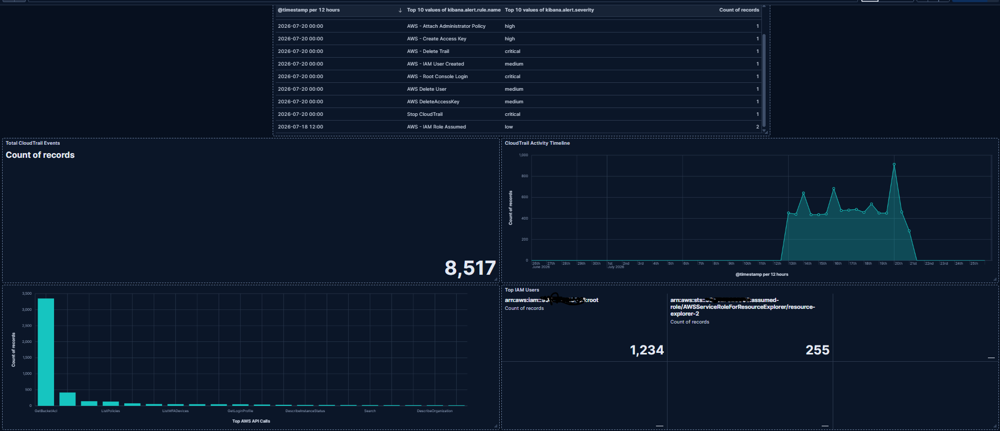
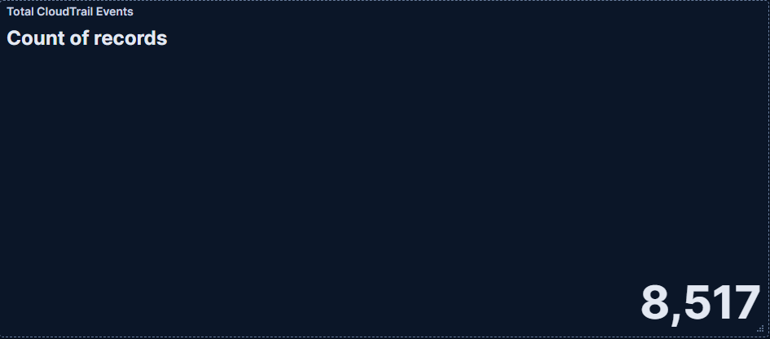
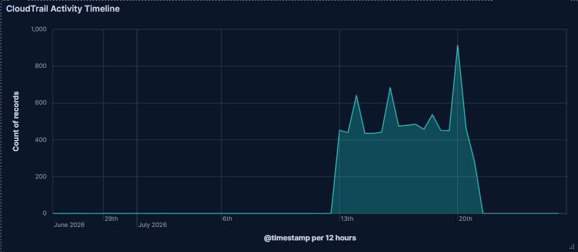
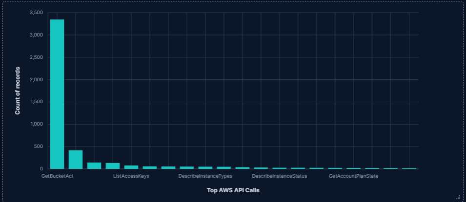
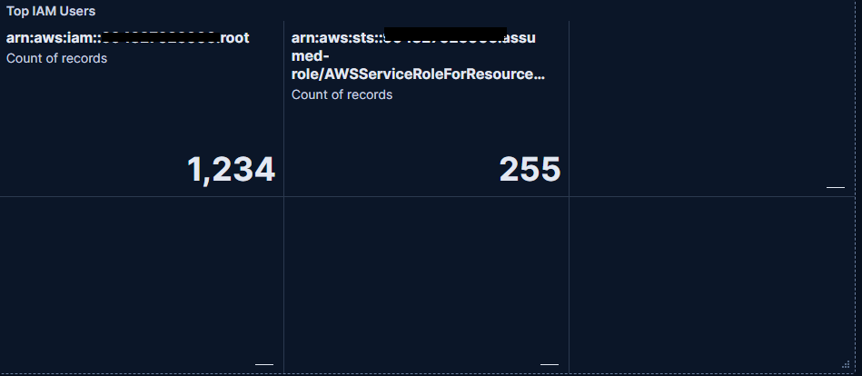
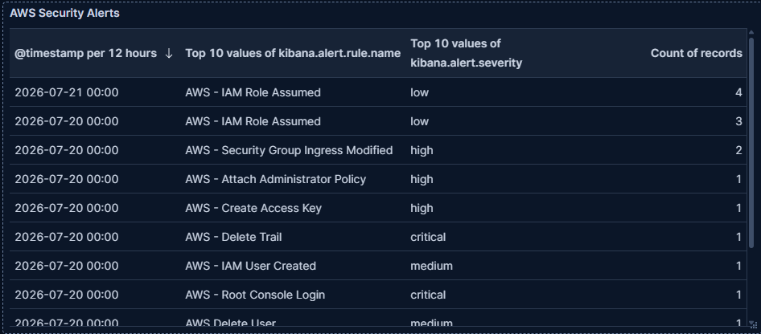

# SOC Dashboard

## Overview

The SOC Dashboard provides centralized visibility into AWS CloudTrail activity and custom detection alerts within Elastic SIEM. It is designed to emulate a Security Operations Center (SOC) workflow by combining high-level metrics, threat detections, and investigative context into a single dashboard.

The dashboard enables analysts to monitor AWS management activity, identify suspicious behavior, prioritize security alerts, and quickly investigate cloud security events.

---

# Dashboard Objectives

- Visualize AWS CloudTrail management activity.
- Monitor custom detection rule alerts.
- Identify suspicious AWS API activity.
- Provide investigation context for security events.
- Demonstrate cloud security monitoring using Elastic SIEM.

---

# Dashboard Panels

## 1. Total CloudTrail Events



### Description

Displays the total number of CloudTrail events within the selected time range.

### Purpose

Provides a high-level overview of overall AWS management activity.

### Visualization

Metric

---

## 2. CloudTrail Activity Timeline



### Description

Displays CloudTrail events over time.

### Purpose

Identifies spikes in AWS management activity that may correspond to administrative actions or suspicious behavior.

### Visualization

Area Chart

---

## 3. Top AWS API Calls



### Description

Displays the most frequently executed AWS API operations.

### Example Events

- ConsoleLogin
- AssumeRole
- GetBucketAcl
- CreateAccessKey
- DeleteAccessKey
- AttachUserPolicy
- CreateUser
- DeleteUser

### Purpose

Provides visibility into the most common AWS management operations occurring within the environment.

### Visualization

Horizontal Bar Chart

---

## 4. Top IAM Identities



### Description

Displays the IAM users and roles responsible for AWS activity.

### Purpose

Helps identify which identities are performing administrative actions.

### Example

- IAM Users
- Assumed Roles
- AWS Service Roles

### Visualization

Horizontal Bar Chart

---

## 5. Detection Alert Table



### Description

Displays alerts generated by the custom detection rules.

### Example Alerts

- Root Console Login
- Create Access Key
- Delete Access Key
- Attach Administrator Policy
- IAM User Created
- IAM User Deleted
- Stop CloudTrail Logging
- Delete CloudTrail
- Security Group Changes
- Assume Role

### Purpose

Provides analysts with a centralized location to review generated security alerts.

### Visualization

Data Table

---

# Dashboard Workflow

```
CloudTrail Event
        │
        ▼
Elastic Agent
        │
        ▼
Elasticsearch
        │
        ▼
Detection Rules
        │
        ▼
SOC Dashboard
        │
        ▼
Security Analyst Investigation
```

---

# Detection Coverage

The dashboard visualizes alerts generated by the following custom detections.

| Detection | Severity |
|------------|----------|
| Root Console Login | Critical |
| Stop CloudTrail Logging | Critical |
| Delete CloudTrail | Critical |
| Attach Administrator Policy | High |
| Create Access Key | High |
| Security Group Changes | High |
| Create IAM User | Medium |
| Delete IAM User | Medium |
| Delete Access Key | Medium |
| Assume Role | Low |

---

# Investigation Workflow

When a detection is generated, an analyst can use the dashboard to:

1. Identify the triggered detection.
2. Review the associated AWS API action.
3. Identify the responsible IAM identity.
4. Determine the originating source IP address.
5. Review CloudTrail activity surrounding the event.
6. Validate whether the activity was authorized.
7. Escalate or remediate if malicious behavior is confirmed.

---

# Skills Demonstrated

This dashboard demonstrates experience with:

- AWS Cloud Security Monitoring
- Elastic SIEM
- Kibana Lens
- SOC Dashboard Development
- CloudTrail Analysis
- Detection Engineering
- Security Monitoring
- Incident Investigation
- KQL
- Data Visualization

---

# Dashboard Screenshots

## Complete SOC Dashboard

*(Insert full dashboard screenshot)*

---

## Detection Alert Table

*(Insert screenshot)*

---

## CloudTrail Activity Timeline

*(Insert screenshot)*

---

## Top AWS API Calls

*(Insert screenshot)*

---

## Top IAM Identities

*(Insert screenshot)*

---

# Summary

This dashboard provides centralized visibility into AWS CloudTrail activity and custom detection alerts using Elastic SIEM. By combining AWS audit logs, custom KQL detections, and analyst-focused visualizations, the dashboard supports rapid identification and investigation of suspicious cloud activity while demonstrating practical SOC monitoring and cloud security operations.
