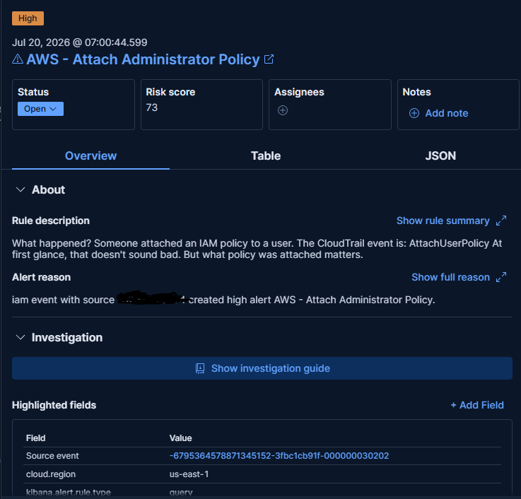

# Attach Administrator Policy Detection



## Overview

Detects AdministratorAccess policy attachment to IAM users.

This activity may indicate privilege escalation.

---

## MITRE ATT&CK

| Tactic | Technique |
|---------|-----------|
| Privilege Escalation | T1098 |

---

## Severity

High

---

## KQL

```kql
event.dataset:"aws.cloudtrail"
and event.action:"AttachUserPolicy"
```

---

## Test Procedure

Attach AdministratorAccess to an IAM user.

---

## Investigation

- Identify who attached the policy.
- Verify change request.
- Determine whether elevated permissions are expected.

---

## False Positives

- Administrative provisioning
- New administrator onboarding
