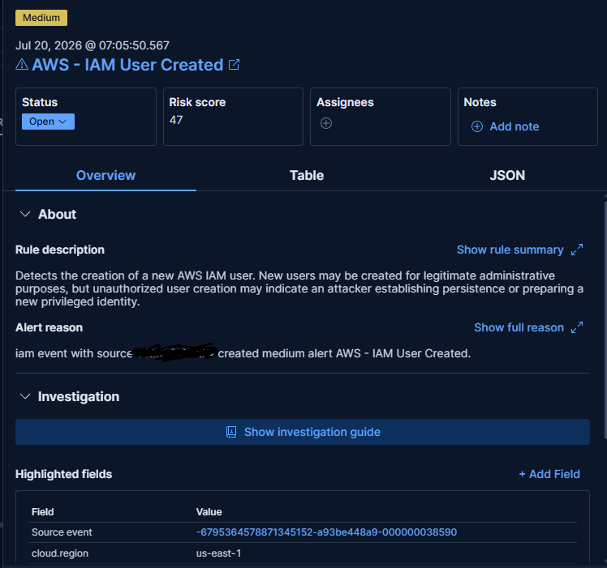

# IAM User Created Detection



## Overview

Detects creation of IAM users.

Unexpected IAM user creation may indicate persistence.

---

## MITRE ATT&CK

Persistence

---

## Severity

Medium

---

## KQL

```kql
event.dataset:"aws.cloudtrail"
and event.action:"CreateUser"
```

---

## Test Procedure

Create an IAM user.

---

## Investigation

- Determine who created the account.
- Verify approval.
- Review attached policies.

---

## False Positives

- HR onboarding
- Infrastructure provisioning
